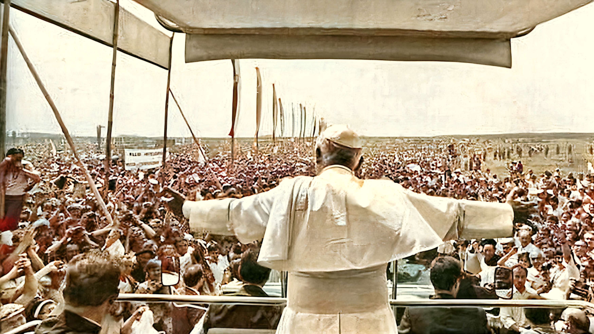

<!-- START OF MAIN TABLE -->
<table><tr><tr><td></td><td>

<table style="width:80%">
    <td style="width:30%;font-family:verdana;color:red;font-size:96px">
      <a href="../assets/pdf/ssb.pdf">🎸 🎼</a>
    </td>
    <td style="width:70%;font-family:verdana;color:red;font-size:64px">
 <a href="../assets/pdf/ssb.pdf">The Star Spangled Banner 🇺🇸</a>
    </td>
</table>

<td></td><tr><td></td><td>

<table style="width:80%">
    <td style="width:30%;font-family:verdana;color:red;font-size:164px">
      <a href="http://www.kofc.org/en/resources/service/council/1582_3_10.pdf">📜 </a>
    </td>
    <td style="width:70%;font-family:verdana;color:red;font-size:64px">
      <a href="http://www.kofc.org/en/resources/service/council/1582_3_10.pdf">History of the United States Flag 🇺🇸</a>
    </td>
</table>
<td></td><tr><td></td><td>

<table style="width:80%">
    <td style="width:30%;font-family:verdana;color:red;font-size:164px">
      <a href="https://www.kofc.org/un/en/resources/communications/pledgeAllegiance.pdf">📜 </a>
    </td>
    <td style="width:70%;font-family:verdana;color:red;font-size:64px">
      <a href="https://www.kofc.org/un/en/resources/communications/pledgeAllegiance.pdf">The Pledge of Allegience 🇺🇸</a>
    </td>
</table>
<td></td><tr><td></td><td>

<tr></table>
<!-- END OF MAIN TABLE -->
 Illustration: Richard E. Barber (Photo by Keystone/Getty Images)

 Love of our country unites us and must unite us above all divergences. It has nothing in common with a narrow nationalism or chauvinism, but springs from the law of the human heart. It is a measure of man’s nobility: a measure that has been put to the test many times during our difficult history.(Pope &#x271E; John Paul II 23 October 1978)
